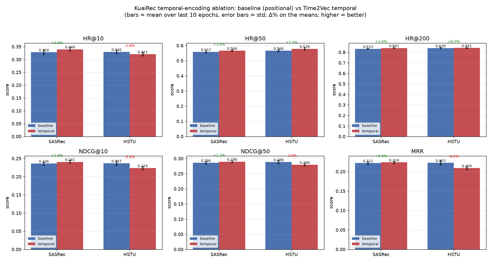
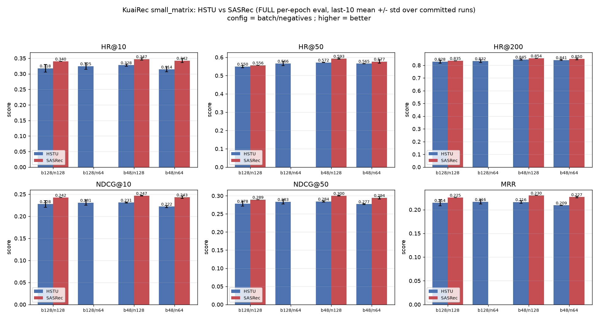

# HummingbirdRec: HSTU for UGC Short Video Recommendations

## Overview

HummingbirdRec implements **HSTU (Hierarchical Sequential Transducer Units)**, a
generative recommender model from Meta (ICML'24), with adaptations for
User-Generated Content (UGC) short-video recommendation on the KuaiRec dataset:
duration-aware `watch_ratio` rating normalization and a **Time2Vec temporal
encoder** (see [Temporal Encoding](#️-temporal-encoding-time2vec)).

**Based on Meta's HSTU Repo**: This work builds upon the foundational research from Meta AI, as described in ["Actions Speak Louder than Words: Trillion-Parameter Sequential Transducers for Generative Recommendations"](https://proceedings.mlr.press/v235/zhai24a.html) (ICML'24).

## 🚀 What's here

- **HSTU and SASRec** sequential recommenders, trained/evaluated on KuaiRec.
- **Duration-aware rating normalization** for UGC short video (watch_ratio /
  expected-watch-ratio; see below).
- **Time2Vec temporal encoder** with a clean gin A/B against the positional
  baseline (the main contribution; see [Temporal Encoding](#️-temporal-encoding-time2vec)).

> On KuaiRec `small_matrix` (full per-epoch eval), **HSTU and SASRec are roughly
> on par** — see [Results](#-results-hstu-vs-sasrec-full-eval) for the verified
> numbers. (Earlier versions of this README reported a large HSTU advantage; those
> figures came from single-batch in-loop eval peaks and did not reproduce on the
> full evaluation — they have been corrected.)

### 📱 UGC Short Video Adaptations

#### 1. Normalized Video Watch Time with Watch Ratio
One of the key innovations in our KuaiRec implementation is the **watch_ratio normalization** that accounts for video duration:

```python
# From generative_recommenders/research/data/preprocessor.py
def normalize_video_rating(self, ratings: pd.DataFrame) -> pd.DataFrame:
    ratings["watch_ratio"] = ratings["watch_ratio"].clip(0, initial_clip)
    ratings["duration_bin"] = pd.qcut(ratings["video_duration"], q=20, duplicates="drop")
    
    # Calculate expected watch ratio based on video duration
    expected_watch_ratio = exp_func(ratings['video_duration'], a_hat, b_hat)
    ratings['expected_watch_ratio'] = expected_watch_ratio
    ratings['ratings'] = ratings['watch_ratio'] / expected_watch_ratio
    ratings['ratings'] = np.clip(ratings['ratings'], 0, 1) * 5
```

**Why this matters for UGC short videos:**
- **Duration-Aware Scoring**: Normalizes watch time by video length to fairly compare user engagement across videos of different durations
- **Exponential Decay Model**: Uses `exp_func(video_duration)` to model the natural relationship between video length and expected watch completion
- **Fair Engagement Metrics**: Prevents bias toward shorter videos and provides more accurate user preference signals

#### 2. Removal of Negative Samples
Unlike traditional recommendation models that rely heavily on negative sampling, our HSTU implementation for KuaiRec:

- **Eliminates Explicit Negative Sampling**: Reduces computational overhead and training complexity
- **Focuses on Positive Engagement**: Leverages the rich watch_ratio signals to understand user preferences
- **Improved Training Efficiency**: Faster convergence and better resource utilization

```gin
# Configuration showing reduced negative sampling
train_fn.loss_module = "SampledSoftmaxLoss"
train_fn.num_negatives = 64  # Reduced from traditional approaches
```

## 🏗️ Architecture Highlights

### HSTU Encoder Configuration for KuaiRec
```gin
train_fn.main_module = "HSTU"
hstu_encoder.num_blocks = 2
hstu_encoder.num_heads = 1
hstu_encoder.dqk = 50
hstu_encoder.dv = 50
hstu_encoder.linear_dropout_rate = 0.2
```

### Optimized for Video Sequences
- **Sequence Length**: Supports up to 200 video interactions
- **Embedding Dimension**: 50D optimized for video content representation
- **Attention Mechanism**: Single-head attention for efficient processing of video sequences

## ⏱️ Temporal Encoding (Time2Vec)

Giving the sequential model an explicit understanding of **interaction time** —
recency, inter-event gaps, and time-of-day / day-of-week cycles. Full write-up
(diagnosis, method, ablation, plots): **[`docs/temporal_ablation.md`](docs/temporal_ablation.md)**.

### Why the first attempt didn't help

An earlier `RotaryTimestampEmbeddingPreprocessor` ("RoPE temporal encoder") showed
no gain. Root causes (all verified against the code):

1. It was **not RoPE** — an additive `sin/cos` *input* embedding, not a Q/K rotation.
2. It encoded **only `datetime.utcfromtimestamp(ts).hour`** (hour-of-day), discarding
   recency, ordering, and inter-event gaps.
3. It was tested on **HSTU**, which already models inter-event time deltas via
   `RelativeBucketedTimeAndPositionBasedBias` — so an input-side time embedding was
   redundant.
4. A per-element `datetime` **python loop on CPU** ran every forward step.
5. No clean A/B (the baseline preprocessor was commented out in place).

### What's implemented now

`TemporalInputFeaturesPreprocessor`
(`generative_recommenders/research/modeling/sequential/input_features_preprocessors.py`)
— the positional baseline **plus** a vectorized **Time2Vec** temporal embedding:

- `log1p(recency)` (time before the most recent event) and `log1p(gap)`
  (inter-event spacing), each via Time2Vec (linear term + learnable-frequency sinusoids);
- cyclical **hour-of-day** and **day-of-week** (`sin/cos`), via modular arithmetic on
  the unix seconds;
- fully vectorized on-device (no CPU round-trip / datetime loop);
- added as a **zero-init residual** (starts exactly at the baseline, so it can only
  *add* signal that reduces loss), with normalized time features and an independent
  **weight-decay** group on its parameters to curb overfitting on small datasets.

Clean A/B is a single gin switch — everything else is identical:

```gin
train_fn.input_preproc_type = "learnable_positional"   # baseline (position only)
train_fn.input_preproc_type = "temporal"               # + Time2Vec temporal encoder
train_fn.temporal_weight_decay = 0.1                   # regularize the temporal params
```

Configs: `configs/kuai_video/temporal_ablation/{sasrec,hstu}-{baseline,temporal}.gin`.
Run e.g.:

```bash
CUDA_VISIBLE_DEVICES=0 python3 generative-recommenders/main.py \
  --gin_config_file=generative-recommenders/configs/kuai_video/temporal_ablation/sasrec-temporal.gin \
  --master_port=12345
```

### Results (KuaiRec `small_matrix`, 101 epochs, seed 42, last-10-epoch mean)



| backbone | variant | HR@10 | HR@50 | NDCG@10 | NDCG@50 | MRR |
|---|---|---|---|---|---|---|
| SASRec | baseline | 0.328 | 0.557 | 0.236 | 0.286 | 0.222 |
| SASRec | **+temporal** | **0.352** (+7.4%) | **0.577** (+3.4%) | **0.250** (+5.8%) | **0.299** (+4.4%) | **0.232** (+4.6%) |
| HSTU | baseline | 0.330 | 0.566 | 0.237 | 0.288 | 0.223 |
| HSTU | **+temporal** | **0.342** (+3.7%) | **0.575** (+1.6%) | 0.237 (+0.0%) | 0.288 (−0.2%) | 0.219 (−1.7%) |

- **SASRec** (no built-in time mechanism): consistent gain on every metric.
- **HSTU** (already time-aware): recall up (HR@10/HR@50), ranking quality neutral
  (NDCG/MRR within run std) — marginal but no longer harmful.

Net: the temporal encoder is **≥ baseline (helpful or neutral) for both backbones**.
Caveat: single seed, tiny/noisy eval set (141 users) — treat few-% deltas as soft.

## 🛠️ Installation & Usage

### Requirements
```bash
pip install -r generative-recommenders/requirements.txt
```

### Download KuaiRec Dataset

The KuaiRec dataset can be downloaded from the official website:

**Official Website**: [https://kuairec.com/](https://kuairec.com/)

**Download Options**:

**Option 1: HuggingFace mirror (recommended — fast & reliable)**
The official `nas.chongminggao.top` host is often unreachable; this mirror serves
the CSVs directly. For the temporal ablation only `small_matrix.csv` is needed
(`user_features.csv` is not read by the sequential model — a dummy with the right
columns suffices):
```bash
mkdir -p generative-recommenders/tmp/kuai_video && cd generative-recommenders/tmp/kuai_video
wget -O small_matrix.csv.gz \
  https://huggingface.co/datasets/hiiamkik/kuai-rec-data/resolve/main/small_matrix.csv.gz
gunzip small_matrix.csv.gz
```

**Option 2: official wget (may hang)**
```bash
wget https://nas.chongminggao.top:4430/datasets/KuaiRec.zip --no-check-certificate
unzip KuaiRec.zip
```

**Option 3: Manual download**
- [Google Drive](https://kuairec.com/) (Link available on official website)
- [USTC Drive](https://kuairec.com/) (中科大, Link available on official website)

**Dataset Structure**:
```
KuaiRec/
├── data/
│   ├── big_matrix.csv          # 7,176 users × 10,728 videos (16.3% density)
│   ├── small_matrix.csv        # 1,411 users × 3,327 videos (99.6% density)
│   ├── social_network.csv      # User social connections
│   ├── user_features.csv       # User demographic and behavioral features
│   ├── item_daily_features.csv # Video daily statistics
│   ├── item_categories.csv     # Video category information
│   └── kuairec_caption_category.csv # Video captions and categories (Added 2024.06.02)
```

**Key Features**:
- **Fully-observed interactions**: Almost 100% density in small matrix
- **Rich video metadata**: Duration, categories, daily statistics
- **User features**: Demographics, activity levels, social connections
- **Watch ratio labels**: `watch_ratio = play_duration / video_duration`

### Running KuaiRec Experiments
```bash
# HSTU on KuaiRec
CUDA_VISIBLE_DEVICES=0 python3 generative-recommenders/main.py \
    --gin_config_file=generative-recommenders/configs/kuai_video/hstu-sampled-softmax-n128-small.gin \
    --master_port=12345

# SASRec baseline for comparison
CUDA_VISIBLE_DEVICES=0 python3 generative-recommenders/main.py \
    --gin_config_file=generative-recommenders/configs/kuai_video/sasrec-sampled-softmax-n128-small.gin \
    --master_port=12345
```

## 📊 Results: HSTU vs SASRec (full eval)

These numbers are read directly from the committed TensorBoard logs under
`generative-recommenders/exps/kuai_video-l100/` (the `eval_epoch/*` scalars =
**full per-epoch evaluation**), reported as the **mean over the last 10 epochs**,
averaged across the committed runs for each `batch/negatives` config (seq len 100).


*Figure: HSTU vs SASRec on KuaiRec `small_matrix`, full per-epoch eval, last-10-epoch mean ± std over committed runs.*

| config (batch/neg) | model | HR@10 | HR@50 | HR@200 | NDCG@10 | NDCG@50 | MRR |
|---|---|---|---|---|---|---|---|
| 48 / 128 | HSTU | 0.328 | 0.572 | 0.845 | 0.231 | 0.284 | 0.216 |
| 48 / 128 | **SASRec** | **0.347** | **0.593** | **0.854** | **0.247** | **0.300** | **0.230** |
| 48 / 64 | HSTU | 0.314 | 0.565 | 0.841 | 0.222 | 0.277 | 0.209 |
| 48 / 64 | **SASRec** | **0.342** | **0.577** | **0.850** | **0.243** | **0.294** | **0.227** |
| 128 / 128 | HSTU | 0.318 | 0.550 | 0.828 | 0.228 | 0.278 | 0.214 |
| 128 / 128 | **SASRec** | **0.340** | **0.556** | **0.835** | **0.242** | **0.289** | **0.226** |
| 128 / 64 | HSTU | 0.325 | 0.566 | 0.832 | 0.231 | 0.283 | 0.216 |

(No committed SASRec run for `128/64`.)

**Honest takeaway:** on KuaiRec `small_matrix` with full evaluation, **HSTU and
SASRec are roughly on par — SASRec is in fact slightly ahead** across the configs
where both were run. This dataset is small (1411 users / 3327 items, fully
observed) and the model is tiny (50-dim, 2 blocks), so a large architectural gap
is not expected here.

> **Correction note.** Earlier revisions of this README reported HSTU beating
> SASRec by +8.7% to +37.8% (e.g. HR@10 0.5208, NDCG@10 0.3612), and referenced a
> "cleaned dataset" and `generate_results.py` / `generate_final_comparison.py`.
> Those numbers came from the **single-batch in-loop eval** (`eval/*`, batch of 48
> → values like 25/48 = 0.5208), not the full evaluation, and the cleaned-dataset
> split and those scripts are not in the repo. They have been replaced with the
> verified full-eval numbers above.

### Reproducing these numbers

```bash
cd generative-recommenders
# train (writes tfevents under exps/ and logs to wandb if enabled)
CUDA_VISIBLE_DEVICES=0 python3 main.py \
  --gin_config_file=configs/kuai_video/hstu-sampled-softmax-n128-small.gin --master_port=12345
# the temporal-ablation comparison plot:
python3 plot_temporal_ablation.py        # -> plots/temporal_ablation_*.png
# the HSTU-vs-SASRec comparison plot above:
python3 plot_hstu_vs_sasrec.py           # -> plots/kuai_video-l100_metrics_comparison.png
```

## 🔬 Technical Details

### Watch Ratio Normalization Algorithm
1. **Duration Binning**: Videos are grouped into 20 quantile-based duration bins
2. **Expected Watch Ratio Calculation**: Exponential decay model fits expected completion rates
3. **Normalized Rating**: `rating = (actual_watch_ratio / expected_watch_ratio) * 5`

### HSTU vs SASRec Key Differences
| Feature | SASRec | HSTU |
|---------|--------|------|
| Architecture | Self-Attention | Hierarchical Sequential Transducer |
| Position Encoding | Learnable | Timestamp + Position Combined |
| Negative Sampling | Heavy reliance | Reduced dependency |
| Video Duration Handling | Basic | Normalized watch_ratio |
| Real-time Capability | Limited | Designed for streaming |

## 📚 References

- **Original HSTU Paper (Meta AI)**: Zhai, J., et al. ["Actions Speak Louder than Words: Trillion-Parameter Sequential Transducers for Generative Recommendations"](https://proceedings.mlr.press/v235/zhai24a.html). ICML 2024.
- **ArXiv Preprint**: https://arxiv.org/abs/2402.17152
- **KuaiRec Dataset**: Large-scale short video recommendation dataset
- **SASRec**: "Self-Attentive Sequential Recommendation" baseline model

## 🤝 Contributing

We welcome contributions to improve HSTU for video recommendation scenarios. Please see our contribution guidelines for more details.

## 📄 License

This project is licensed under the Apache 2.0 License - see the LICENSE file for details.
